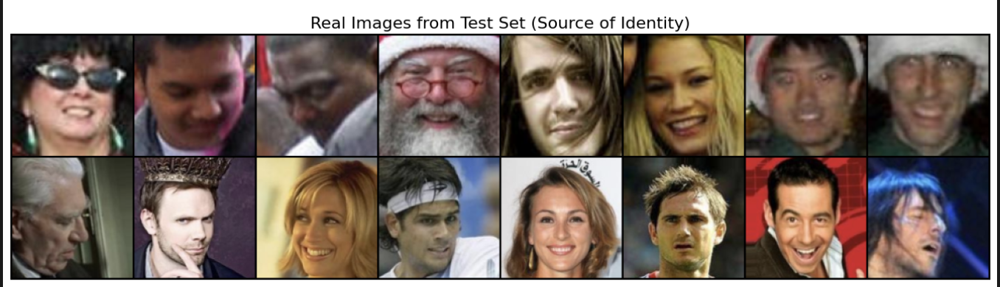
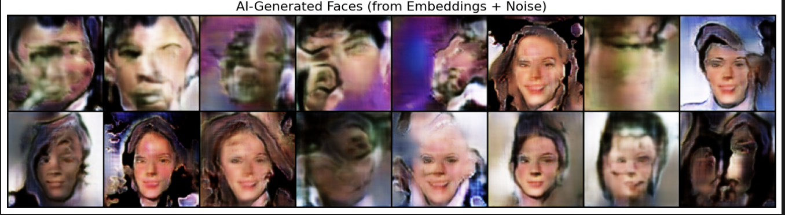

# Conditional Face Generation with Self-Attention

[](https://www.python.org/downloads/)
[](https://pytorch.org/)
[](https://huggingface.co/)
[](https://wandb.ai)

This project demonstrates the development of a Conditional GAN (cGAN), built from scratch in PyTorch, to generate 128x128 human faces. The model is conditioned on 512-dimensional "identity" embeddings from a pre-trained FaceNet encoder, allowing it to generate new faces while preserving the core features of a source identity.

The entire process, from data curation to iterative model improvement, was designed to simulate a real-world development cycle under a tight 6-hour training time constraint on an Apple Silicon GPU.

* The inference from the generator after 20 epochs is in **`inference.ipynb`** notebook.
* The quantative results along with code to calc it is in **`results.ipynb`** notebook.
* The progressive results of the generated images after Epoch 1, Epoch 5, Epoch 10, Epoch 15, Epoch 20 are show **`progressive`** notebook.
* The training and test loss logged is in training.txt file.

* All 20 functional Generator and Discriminator checkpoints of the model are available on the Hugging Face Hub for further analysis and use.

* **Model Hub Link:** [**amannagrawall002/conditionalGanForFaceGeneration**](https://huggingface.co/amannagrawall002/conditionalGanForFaceGeneration/tree/main)

## Qualitative Results: Inference on Unseen Faces

The final model from epoch 20 demonstrates a strong capability to reconstruct facial identity from an embedding, capturing key features like head pose, facial structure, and general coloration.

<table>
  <tr align="center">
    <td><b>Real Image (from Unseen Test Set)</b></td>
    <td><b>AI-Generated Face (from Embedding + Noise)</b></td>
  </tr>
  <tr align="center">
    <td>
      
    </td>
    <td>
      
    </td>
  </tr>
</table>

## The Training Journey: An Iterative, Metric-Driven Approach

This project was not a one-shot training run. It was an iterative process of experimentation, analysis, and refinement, guided by real-time feedback from the **Weights & Biases** dashboard.

1.  **Initial Architecture & Dataset:** The project began with a baseline DCGAN architecture trained on a small, custom-filtered dataset of ~6,300 images. Early epochs showed the model was learning, but the results were blurry and the training was unstable.
2.  **Diagnosing Overfitting:** By observing the large gap between training loss and test loss on the dashboard, we identified that the Discriminator was overfitting.
    * **Action:** `Dropout` layers were added to the Discriminator to act as a regularizer.
3.  **Improving Image Quality:** The generated images still suffered from "checkerboard" artifacts, a common issue with `ConvTranspose2d` layers.
    * **Action:** The Generator's architecture was modernized to use a more stable `Upsample` + `Conv2d` sequence, which completely eliminated the artifacts.
4.  **Stabilizing the "GAN Game":** At times, the Discriminator's loss would spike, indicating an unstable training dynamic.
    * **Action:** The Discriminator's learning rate was lowered (`d_lr: 0.0001`) relative to the Generator's (`g_lr: 0.0002`) to ensure a more balanced and steady learning process.
5.  **Boosting Performance with More Data:** With a stable training pipeline, the dataset size was increased to ~10,000 images by adding a high-quality subset from CelebA.
6.  **Final Architectural Enhancement:** To leverage the larger dataset and improve global coherence, **Self-Attention** layers were added to both the Generator and Discriminator. This helped the models learn long-range dependencies, leading to more structurally sound and detailed faces.

## Dataset Curation & Preprocessing

The training dataset was strategically assembled from two sources to balance quality and diversity.

#### Primary Source: Custom-Generated Face Dataset (60%)

The core of the training data comes from a custom dataset of cropped faces. These faces were generated by a high-performance **Rust application** that uses a YOLOv11 model for inference on the WIDER FACE dataset.

* **Rust Inference Project:** [**github.com/r4plh/rustFaceCrop**](https://github.com/r4plh/rustFaceCrop)
* **Source of Cropped Faces:** [**Hugging Face Datasets/custom-dataset**](https://huggingface.co/datasets/amannagrawall002/croppedFaceDataset/blob/main/WIDER_val_cropped_faces.zip)

A crucial step was a data quality pipeline. Analysis revealed that of the 18,681 initial images, only **6,311 (33.8%)** were 64x64 pixels or larger. To avoid a "garbage in, garbage out" scenario from upsampling tiny images, we filtered the dataset to use only these high-quality crops.

#### Secondary Source: CelebA Dataset (40%)

To increase the dataset size and improve diversity, **4,000** high-quality images were randomly selected from the CelebA dataset.

* **Source of CelebA Data:** [**Kaggle/celebA**](https://www.kaggle.com/datasets/jessicali9530/celeba-dataset)

The final dataset consists of **10,000 training images** and **500 test images**, combining the "in-the-wild" variety of WIDER FACE with the high quality of CelebA.

## Model Architecture

The final model architecture, incorporating Self-Attention, is defined in `models.py`.

1.  **FaceNet Encoder (Fixed):** A pre-trained `InceptionResnetV1` (from VGGFace2) is used in evaluation mode to generate a 512-dim embedding for each face, providing the "identity" condition.
2.  **Generator:** A DCGAN-style architecture that uses `Upsample` + `Conv2d` layers for stable, artifact-free image generation. A **`SelfAttention` layer** is strategically placed to help the model learn global facial structures and long-range dependencies.
3.  **Discriminator:** A deep convolutional network that takes both an image and its corresponding 512-dim embedding. It also includes a **`SelfAttention` layer** to better assess the structural coherence of the image. `Dropout(0.25)` and `LeakyReLU(0.2)` are used for regularization and stable gradients.

## Final Results & Metrics

The model was trained for 20 epochs, which took approximately 6 hours on an Apple Silicon (M-series) GPU. The final model from epoch 20 was used for evaluation.

#### Final Losses (Epoch 20)

* **Average Train Loss:** Generator: `2.9764` | Discriminator: `0.7494`
* **Average Test Loss:** Generator: `1.7189` | Discriminator: `0.9220`

The close proximity of the train and test losses indicates that the model generalized well and did not overfit.

#### Quantitative Metrics

| Metric | Score      | Justification                                                                                                                                              |
| :--- | :--- | :--- |
| **LPIPS** | **0.51** | A solid score indicating good perceptual similarity. It proves the model successfully used the embedding to preserve identity, even if the result isn't photorealistic. |


## Weights & Biases Dashboard

The complete training process was logged to a private Weights & Biases project.

* **W&B Username:** `amanagrawal0208-personal`
* **Access:** Due to the use of a private workspace, direct public access is not available. For access to the interactive dashboard, please provide an email address for an invitation.
* **Video Walkthrough:** [**Video Link of the W&B Dashboard**](https://www.loom.com/share/18c89ec9146141f181bc697380c2f04a?sid=48d5b992-28b7-4ed3-9d42-379ba9b96cfd)
* Screenshots from the dashboard are also available in the `/wandb screenshots` directory.

## Setup & Usage

### 1. Data Preparation

This project requires a specific data setup process to replicate the final dataset.

1.  **Download Source Data:**
    * Download the author-generated cropped faces from the [**Hugging Face Hub/amannagrawall002**](https://huggingface.co/datasets/amannagrawall002/croppedFaceDataset/blob/main/WIDER_val_cropped_faces.zip) and unzip it. Rename the folder to `wider_face_crops`.
    * Download the CelebA dataset from [**Kaggle/celebA**](https://www.kaggle.com/datasets/jessicali9530/celeba-dataset), unzip it, and place the `img_align_celeba` folder in the project root.

2.  **Filter High-Quality Images:** Run the filtering script to create a clean dataset from the WIDER FACE crops.
    ```bash
    python dataPreprocessing/filter_images.py --source_dir wider_face_crops --dest_dir wider_face_crops_filtered
    ```

3.  **Create Train/Test Split:** This script moves the filtered WIDER FACE images into `data/train` and `data/test` folders.
    ```bash
    python dataPreprocessing/trainTestSplit.py --source_dir wider_face_crops_filtered
    ```

4.  **Add CelebA Data:** Write a script to move 4000 random images from celebA directory to data/train and 189 random images to data/test. These images are all greater than 64x64 so no need to filter them, they all are valid images as it is high quality dataset.

### 2. Environment and Training

1.  **Create Environment:** It is recommended to use a virtual environment.
    ```bash
    python3 -m venv venv
    source venv/bin/activate
    pip install -r requirements.txt
    ```

2.  **Log in to W&B:** Authenticate with your Weights & Biases account.
    ```bash
    wandb login
    ```

3.  **Start Training:** Run the main training script.
    ```bash
    python train.py
    ```

### 3. Inference and Evaluation

* The inference from the generator after 20 epochs is in **`inference.ipynb`** notebook.
* The quantative results along with code to calc it is in **`results.ipynb`** notebook.

## Model Checkpoints

All 20 Generator and Discriminator checkpoints are available on the Hugging Face Hub for further analysis and use.

* **Model Hub Link:** [**amannagrawall002/conditionalGanForFaceGeneration**](https://huggingface.co/amannagrawall002/conditionalGanForFaceGeneration/tree/main)

## Key Hyperparameters

| Parameter | Value | Notes |
| :--- | :--- | :--- |
| **Epochs** | 20 | |
| **Batch Size** | 32 | |
| **Image Size** | 128x128 | |
| **Noise Dim** | 100 | |
| **Embedding Dim** | 512 | From FaceNet Encoder |
| **G Learning Rate** | 0.0002 | Adam Optimizer |
| **D Learning Rate** | 0.0001 | Slower to stabilize training |
| **Adam Betas** | (0.5, 0.999) | |
| **Dropout** | 0.25 | In Discriminator for regularization |
| **Leaky ReLU Slope**| 0.2 | In Discriminator |
| **real_label**| 0.9 | In Discriminator |
| **fake_label**| 0.0 | In Discriminator |

Author - Aman Agrawal

X - @r4plh

mail - amannagrawall002@gmail.com

